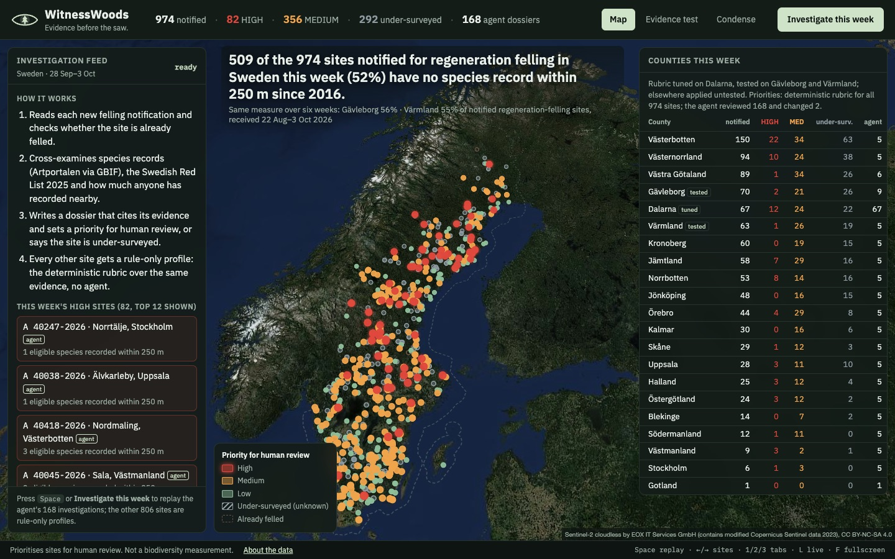
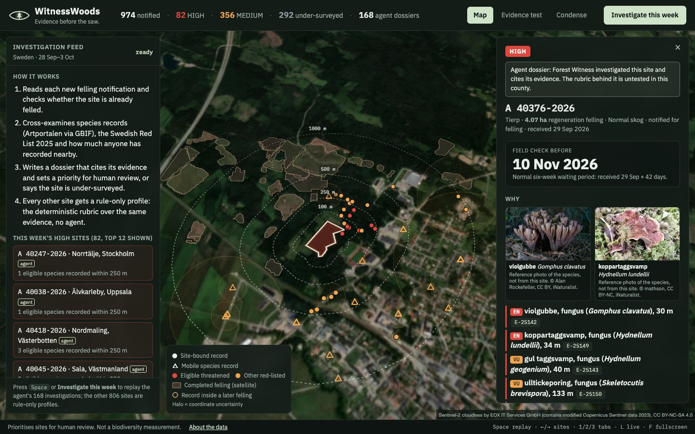
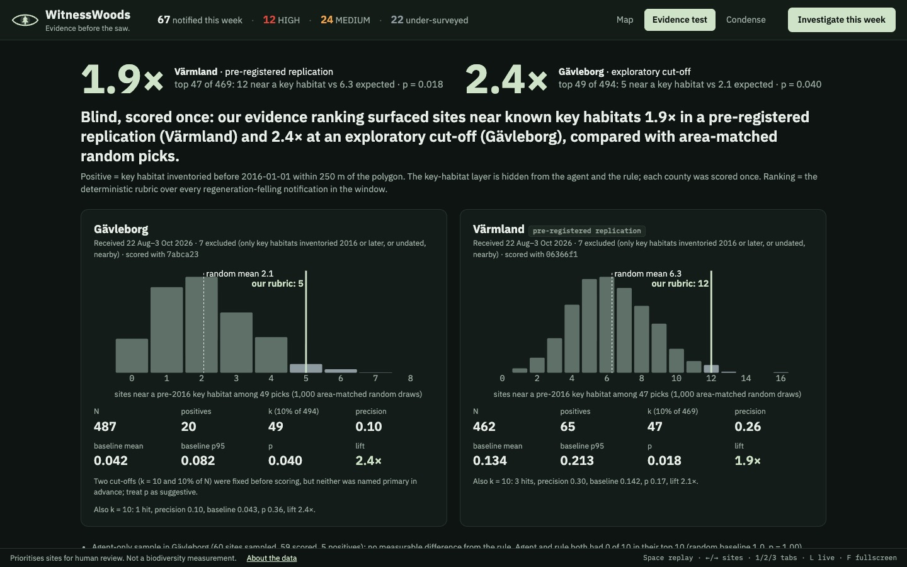
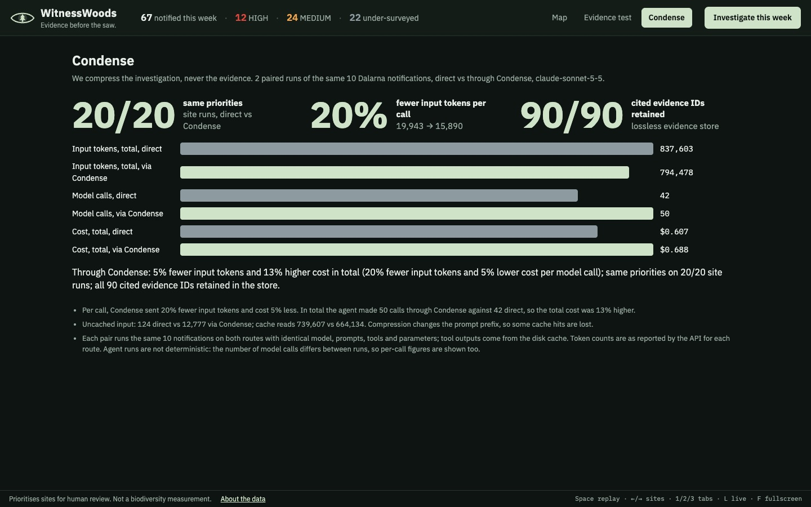

# WitnessWoods

*One dataset can lie. We ask all of them.* · *Evidence before the saw.*

Every week, new forests are notified for felling across Sweden. Regeneration felling of 0.5 ha or more normally may not start until six weeks after notification, and that window is the only time human ecologists can look at a site. Nobody can check every notification by hand.

WitnessWoods triages newly notified felling sites for human ecological review. Its agent, **Forest Witness**, cross-examines independent open datasets for each notification and writes an evidence dossier:
- a review priority: HIGH, MEDIUM, LOW, UNDER_SURVEYED or ALREADY_FELLED;
- the reasons, each citing stored evidence IDs;
- contradictions between sources;
- uncertainties;
- what the evidence does not establish;
- a next action for a human reviewer, before the six-week window closes.

**What it does not do.** It does not measure biodiversity, does not judge whether felling is legal or right, and never says a site is safe to fell. Absence of records is not absence of species: a site nobody has recorded is marked UNDER_SURVEYED, not LOW. A species record shows that the species was recorded there, not that it occupies the site today. A Red List category describes extinction risk, not legal protection.

## This week, all of Sweden

974 regeneration-felling notifications were received in Sweden from 28 Sep to 3 Oct 2026, across 21 counties. Every one has an evidence profile and a priority from the deterministic rubric. 168 have a full agent dossier: the whole Dalarna week, the top 5 sites by rubric ranking in every county, some Gävleborg sites from the held-out run, and one live run. The rest are clearly labelled rule-only profiles, and any of them can be sent to the agent with one click.

- **Rubric:** tuned on Dalarna and tested on Gävleborg and Värmland. Elsewhere it is applied untested, and the UI says so for each county.
- **Effort reference:** each county is judged against its own sites. Counties with fewer than 10 notifications this week fall back to the national median.
- **Unrecorded sites:** 509 of the 974 sites (52%) have no species record within 250 m since 2016.




Species photos are *reference photos of the species, not from the site*. They come from iNaturalist (licensed photos only), with Wikidata/Wikimedia Commons as the fallback. Each is shown with its author, licence and source, and stored in `web/data/img/` so the demo runs offline.

## Results

**The question:** without ever seeing key habitats (nyckelbiotoper), does the evidence ranking put sites near known key habitats at the top more often than an area-matched random selection?

| Test | N | Base rate | k | Precision@k | Random baseline | p | Lift |
|---|---|---|---|---|---|---|---|
| **Värmland, pre-registered replication** (primary k = 10% of N) | 462 | 14.1% | 47 | 0.26 | 0.134 | **0.018** | **1.9×** |
| Gävleborg, exploratory cut-off | 487 | 4.1% | 49 | 0.10 | 0.042 | 0.04 | 2.4× |
| Gävleborg, agent on a 60-site sample | 59 | 8.5% | 10 | 0.00 | 0.096 | 1.0 | 0.0 |

**Headline result.** In a county the project never looked at (Värmland), the deterministic evidence rubric's top 10% of new felling notifications were about twice as likely as area-matched random picks to lie within 250 m of a key habitat inventoried before 2016. The test was pre-registered in code (commit `06366f1`) before any Värmland label was fetched, and scored once.

**Caveats.**
- **Gävleborg:** two cut-offs were fixed before scoring (commit `7abca23`), but neither was named primary, so treat its p-value as suggestive.
- **The agent itself:** on its 60-site held-out sample (only 5 positives), the agent did no better than the baseline. We report that as is.
- **Proxy, not truth:** key habitats are an evaluation proxy, hidden from the agent and the rule. Species records are used only from 2016, and positives need a key habitat inventoried before 2016. That is strong temporal separation, not perfect independence.

**How much is unrecorded.** 43 of the 67 sites notified in Dalarna in the week of 28 Sep to 3 Oct 2026 (64%) have no species record within 250 m since 2016. Over six weeks the share is 56% in Gävleborg and 55% in Värmland.

**Condense A/B** (2 paired runs of the same 10 notifications, direct vs through Condense, same model, prompts and cached tool outputs):
- Same priorities on 20 of 20 site runs, and all 90 cited evidence IDs are retained.
- Per model call, Condense sent 20% fewer input tokens and cost 5% less.
- The agent made more calls through Condense (50 against 42), so total input was only 5% lower and total cost was 13% higher.

We report dollars, not just tokens, because lost cache hits can eat the savings. Full numbers are in `web/data/condense.json`.




## How it works

- **Evidence per notification:**
  - the felling notification;
  - overlap with completed fellings (satellite change detection);
  - Artportalen species records since 2016, sorted into distance rings (inside, 100, 250, 500 and 1000 m);
  - observation effort, compared with a county reference, both near the site and within 1 km.

  A record counts for a ring only if its coordinate uncertainty is no larger than the ring, so records whose location was deliberately blurred, such as sensitive species, never count as near a site.
- **Swedish Red List 2025:** joined to the records by Dyntaxa taxon ID. A species is *eligible* when it is:
  - threatened (CR, EN or VU);
  - forest-associated;
  - threatened by forestry (dead wood, continuity forest, old trees, stand changes);
  - site-bound (fungi, lichens, mosses, plants, wood-living insects).

  Birds and mammals only ever count as supporting evidence.
- **Rubric:** [`prompts/rubric.md`](prompts/rubric.md) gives a deterministic `rubric_hint`. The agent may override it only with a reason that cites evidence; LOW is impossible when recording effort is below the county median.
- **Agent:** a hand-written tool loop over the Anthropic Messages API (Claude Sonnet 5.5), with no framework. It has eight tools. `landscape_context` is context only and never part of the rubric: it reports hectares felled within 1 km by year range, and red-listed records that lie inside an area felled after they were made. `record_finding` rejects any dossier that cites missing evidence IDs or breaks the honesty rules.
- **Memory:** "compress the investigation, never the evidence". Every fact is stored losslessly in SQLite with an ID, and every network response, including map tiles, is cached to disk.
- **Validation:** the key-habitat layer is queried only in `fw/validate.py` and is never an agent tool. The order is fixed: freeze the sample, run blind, then fetch labels and score once.

## Run it

**Replay mode, no API keys needed.** This uses the committed demo snapshot in `web/data/`:

```bash
python3 -m venv .venv && .venv/bin/pip install -r requirements.txt
.venv/bin/python server.py      # then open http://127.0.0.1:8000
```

Keys: <kbd>Space</kbd> replays the week, <kbd>←</kbd>/<kbd>→</kbd> step through sites, <kbd>1</kbd>/<kbd>2</kbd>/<kbd>3</kbd> switch tabs, <kbd>F</kbd> toggles fullscreen. Map tiles need the internet the first time they are viewed, after which they are served from the disk cache. Without tiles the map falls back to a plain background with the county outline.

**Full pipeline** (needs `ANTHROPIC_API_KEY`; Condense is optional):

```bash
cp .env.example .env                                         # add keys; FW_ROUTE=direct works without Condense
.venv/bin/python scripts/smoke.py                            # hit every data source once
.venv/bin/python -m fw.inspect_cli "A 41007-2026"            # evidence profile, no LLM
.venv/bin/python -m fw.agent --lannr 20 --since 2026-09-28   # investigate a week of Dalarna notifications
.venv/bin/python scripts/build_web_data.py                   # rebuild web/data from the dossiers
.venv/bin/python -m fw.validate --lannr 17 --replication --stage score   # how the replication was scored
.venv/bin/python scripts/ab_condense.py                      # one more Condense A/B pair
.venv/bin/python scripts/national.py all                     # evidence profiles for every notification in Sweden this week
.venv/bin/python scripts/national_agents.py --per-county 5   # agent on the top 5 per county
.venv/bin/python scripts/species_photos.py                   # reference photos for cited species
.venv/bin/python scripts/build_web_data.py --national        # rebuild web/data for all of Sweden
```

`scripts/ui_check.py` takes acceptance screenshots with Playwright, using the installed Chrome (`pip install playwright`).

## Related work

- **[Avverkningsvakten Östergötland](https://github.com/markussfranzen/avverkningsvakten-ostergotland)**: a daily open-data screening of felling notifications in Östergötland. It checks them against protected and red-listed species records, key habitats, modelled conservation value and the six-week deadline. It publishes a ranked list and dashboard, and drafts letters for a person to check and send. WitnessWoods additionally measures recording effort (UNDER_SURVEYED), uses Red List threat factors, writes evidence-cited dossiers and is validated against held-out key habitats.
- **[avverkningskoll.se](https://www.avverkningskoll.se/)**: lists current felling notifications from Skogsstyrelsen's data on a map and in a table, with optional email alerts for chosen areas. It makes no ecological assessment.
- **[Skogens karta](https://www.skogsstyrelsen.se/e-tjanster-och-kartor/karttjanster/skogens-karta/)** (Skogsstyrelsen, launching October 2026, successor to Skogens pärlor): the agency's open map, showing notifications and completed fellings alongside key habitats, nature values and other layers, for a person to inspect one area at a time. WitnessWoods investigates every new notification automatically and ranks where field time should go.
- **[Metsävahti](https://github.com/EemeliSurakkaBrink/metsavahti)** (Finland): an open-source, self-hosted service. It emails users when a forest use notification appears inside an area they draw on a map, using the Finnish Forest Centre's open data. It alerts on notifications without assessing them.

## Data sources and licences

- **Skogsstyrelsen** (Swedish Forest Agency): felling notifications, completed fellings and key habitats. CC0.
- **Artportalen via GBIF**: dataset `38b4c89f-584c-41bb-bd8f-cd1def33e92f`. CC0.
- **SLU Artdatabanken, Swedish Red List 2025** ([doi:10.5878/2x1z-jm10](https://doi.org/10.5878/2x1z-jm10)). CC0.
- **iNaturalist** and **Wikimedia Commons**: species reference photos, each under its own licence as shown in the UI.
- **[Sentinel-2 cloudless](https://s2maps.eu) by EOX IT Services GmbH** (contains modified Copernicus Sentinel data 2023): map basemap only. CC BY-NC-SA 4.0, non-commercial use.
- **OpenStreetMap contributors**: fallback basemap and county outline. ODbL.

Locations of sensitive species are protected in public data. WitnessWoods never tries to recover them.

Built with Claude Code; agent traffic routed through Condense.
